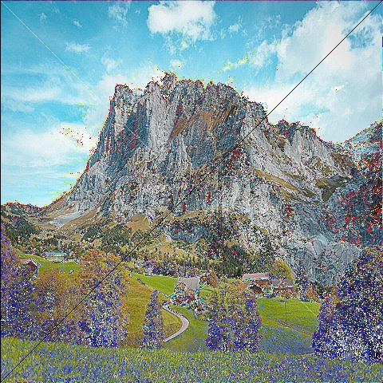

# cuda_ex

To practice cuda C/C++ programming.

# run
```
nvcc main.cpp cuda_ex.cu -o cuda_app `pkg-config --libs opencv` && ./cuda_app
```

or

```
cmake CMakeLists.txt && make && ./cuda_app
```

# result

- result of convolution computing between gpu and cpu about same image.
    - result_cpu_conv.jpg(computing time : 45ms)
    

    - result_gpu_conv.jpg(computing time : 0.025ms)
    
